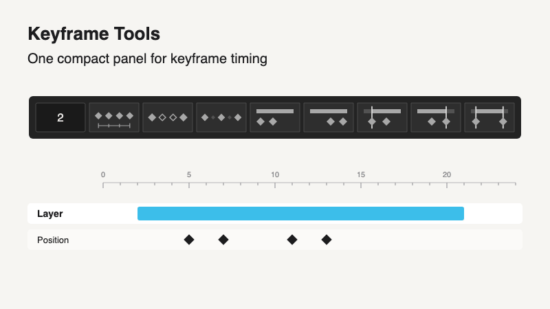

# Keyframe Tools

A compact panel for keyframe timing and for trimming layers to their keys. It brings Spacing and Stepped Keyframes together with Keep, Keys to layer in/out and Trim. Like other compact panels, its buttons follow the panel's shape: a narrow panel shows a column, a wide one a single row, and in between a 3 × 3 square.

## Install as a panel

1. Copy `Keyframe-Tools.jsx` into After Effects' **ScriptUI Panels** folder and restart AE:
   - macOS: `/Applications/Adobe After Effects <version>/Scripts/ScriptUI Panels`
   - Windows: `C:\Program Files\Adobe\Adobe After Effects <version>\Support Files\Scripts\ScriptUI Panels`
2. Open it from the **Window** menu and dock it like any other panel.

You can also run it once with **File → Scripts → Run Script File…**; it then opens as a floating window. Hover a button to see its name.

## The panel, top to bottom

- **N:** one whole number for the first three buttons: frames for Space and Step, keys for Keep. The panel remembers it.
- **Space:** spaces the selected keys N frames apart, starting from the first selected key. Each property is spaced on its own; unselected keys keep their time.
- **Step:** adds keys every N frames between the selected keys, following the original animation: values are sampled before anything changes, existing keys are kept, and on Position the motion path keeps its curve. For hard steps, switch the keys to Hold in After Effects afterwards.
- **Keep:** keeps every Nth selected key (2 keeps every other one) and removes the selected keys between them. The first and last selected keys always stay, and keys you did not select are never removed.
- **Keys to layer in:** moves each layer's selected keys together so the first one lands on the layer's in point. Their spacing is kept.
- **Keys to layer out:** the same, with the last key landing on the layer's last visible frame (one frame before its out point).
- **Trim in:** the selected layers start on their first keyframe.
- **Trim out:** they end right after the frame of their last keyframe.
- **Trim both:** both at once.

When something can't be done, a message explains why and nothing changes. When it works, there is no message: the change is in the timeline. One Cmd/Ctrl+Z undoes each action.

## Details

- Space and Keys to layer in/out: if a moved key would land on a key you did not select, nothing changes and the message says where. Keys are not clipped to the layer's in and out points; After Effects allows keys outside them.
- Step adds at most 10,000 keys at a time. Keys with auto-Bezier motion paths let After Effects recalculate their handles around the new keys, so the path may shift slightly near them.
- Easing, interpolation, selection and labels of the keys that stay are kept.
- Trim: every keyframe on the layer counts, selected or not. Layer markers do not. Footage can't be extended beyond its source; if a layer would need that, nothing changes and the message names the layer.
- The timing buttons refuse roving keys, temporal auto-Bezier or continuous keys, and properties with expressions. Every button refuses locked layers.

## KBar

Add a KBar button that runs `Keyframe-Tools.jsx` and set its **argument** to one action: `space`, `step`, `keep`, `keys-in`, `keys-out`, `trim-in`, `trim-out` or `trim-both`. The button runs that action directly, with the N last used in the panel.
