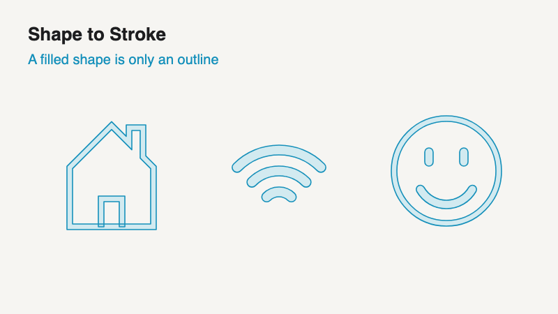

# Shape to Stroke (experimental)

Turns a **filled** outline shape into an **editable stroke** on a centerline, so you can animate it with Trim Paths, change its width or swap its color like any line drawn in After Effects.

It only converts shapes it can read with confidence. Anything else is refused with an explanation, and nothing in your comp changes.

## How to use

1. Save your project (or work on a copy).
2. Select one or more shape layers (up to 25).
3. Run **File → Scripts → Run Script File… → `Shape-to-Stroke.jsx`**.
4. Choose what happens to the **Original**:
   - **Keep disabled** (default): the original stays in the comp, hidden, right below the new layer.
   - **Delete**: the original is removed after every new layer has been checked.
5. Optionally tick **Animate Trim Paths** for a 12-frame draw-on starting at the current time.
6. Click **Create**.

The new layer is named `<original name> [Centerline]`, keeps the original's color, opacity, transforms and parenting, and is selected when the script finishes. One **Cmd/Ctrl+Z** undoes the whole operation. The dialog remembers your last choices.

To draw in the other direction, switch on **Reverse Path Direction** on the new path in the timeline.

## What it can convert

Each shape layer must hold one outline (or two, for rings and frames) with a single solid fill:

| Filled shape | Becomes |
| --- | --- |
| Bar or rectangle, capsule | Straight line (flat or round ends) |
| Ring (two circles) | Circle |
| Arc band, with flat or round ends | Arc |
| Hollow polygon or rounded frame (two outlines) | Closed path with sharp or rounded corners |
| Constant-width zigzag, L, V, Z, U, check mark… | Open polyline |

Small irregularities are accepted when the new stroke's edge stays within about **half a pixel** of the original edge (less on very thin lines, at 100% layer scale). Look at the result before deleting an original.

## What it refuses

- Solid shapes with no hole (a filled star, circle or square): an outline is not a line.
- Shapes whose thickness changes, lettering, arrowheads, crossings or branches.
- Layers with effects, masks, mattes, layer styles, expressions, animated shape paths, gradients, existing strokes or shape operators such as Merge Paths.
- Several shape groups side by side in one layer: split them into separate layers first.
- Rings/frames with **Reverse Path Direction** on: turn it off (switch the Fill Rule to Even-Odd if the hole disappears).

Shapes imported from Illustrator or Figma often use Merge Paths or several groups per layer, so they may need that preparation first. Support for real imported files is the next step.

## Try it on test shapes

Run **`Create-Test-Fixtures.jsx`** (keep it in this folder with its companion files). It adds three comps to your project without saving it:

- **READY** – shapes that should convert.
- **SKIP** – shapes that should be refused with an explanation.
- **ICONS** – the 16 icons pictured above, split into layers; every layer should convert.

## Good to know

- Experimental: tested on After Effects 26.5 (macOS). Windows and older versions have not been tested.
- **Delete** is refused if the original is the parent of another layer; Keep disabled keeps parenting intact.
- Expressions elsewhere that point to the original layer are not updated.

Technical details, tolerances and test records: [TECHNICAL.md](TECHNICAL.md) · Supported shape families: [CAPABILITIES.md](CAPABILITIES.md)
